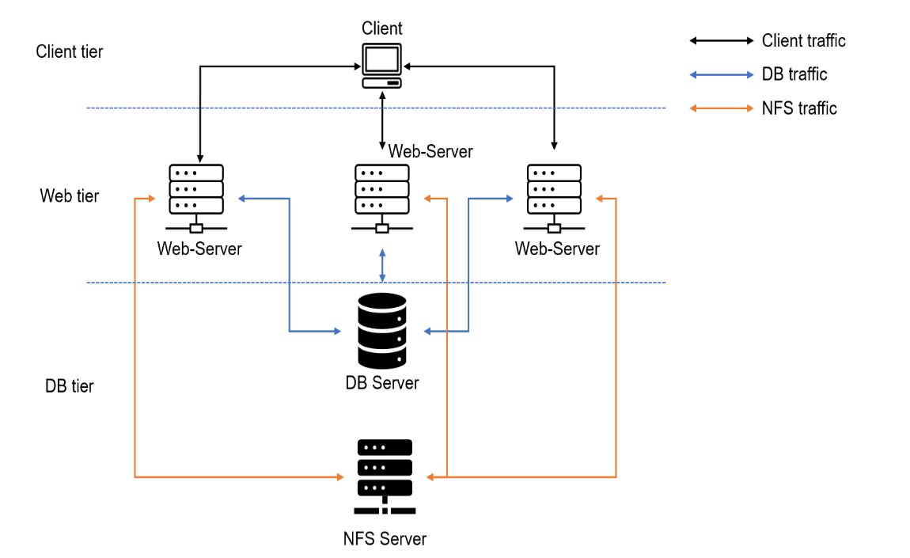
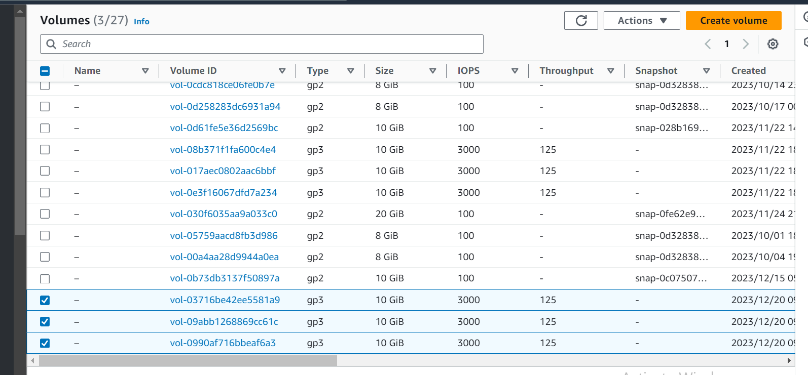
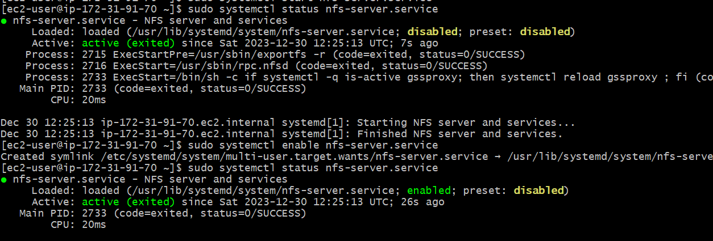

### DEVOP TOOLING WEBSITE SOLUTION


As a devop Engineer or  a member of DevOps Team, you will implement a website solution which makes access to DevOps easily accessible within the corporate infrastructures.

In this project, I implemented a solution that consists of infratstructures like:
1) Infrastructure: AWS 
2) Webserver Linux: Red Hat Enterprise Linux 8
3) DataBase Server: Ununtu 20.04 + MYSQL
4) Storage Server: RED Hat Enterprise Linux 8 + NFS Server
5) Programming Language: PHP
6) Code Repository: Github


On the diagram below, we see stateless servers share a common databases and also access same file using  Network file system (NFS) as shared storage. Even if the NFS is located on a different or separate hardware 





### Implementing a Business website using NFS for the Backend Storage File.


Step 1: Prepare NFS Server

1. Spin up a new EC2 instance with RHEL Linux 8 Operating System.
2. Configure LVM on the server.

Creating three volumes in  the same AZ of the NFS server provisioned.





* . Instead of formatting the disk as ext4, it is formatted as xfs
I used the command `mkfs.xfs` to format the logical volume with xfs filesystem.

 `sudo mkfs -t xfs /dev/webdata-vg/lv-apps`

 `sudo mkfs -t xfs /dev/webdata-vg/lv-logs`

 `sudo mkfs -t xfs /dev/webdata-vg/lv-opt`

* . Ensuring there are three logical volumes lv-opt, lv-apps, and lv-logs

create the lv with the command below:


 `sudo lvcreate -n lv-apps -L 9G webdata-vg`

 `sudo lvcreate -n lv-logs -L 9G webdata-vg`
 
 `sudo lvcreate -n lv-opt -L 9G webdata-vg`


* . Create Mount points on /mnt directory for the logical volumes as follow:
Mount lv-apps on /mnt/apps - Used by Webserver

`sudo mkdir /mnt/apps`

`sudo mount /dev/webdata-vg/lv-apps /mnt/apps`

Mount lv-logs on /mnt/logs - Used by webserver logs

`sudo mkdir /mnt/logs`

`sudo mount /dev/webdata-vg/lv-logs /mnt/logs`


Mount lv-opt on /mnt/opt - Used by Jenkins server

`sudo mkdir /mnt/opt`

`sudo mount /dev/webdata-vg/lv-opt /mnt/opt`


4. Install NFS server, congiure it to start on reboot and make sure it is up and running.

```
sudo yum -y update
sudo yum install nfs-utils -y
sudo systemctl start nfs-server.service
sudo systemctl enable nfs-server.service
sudo systemctl status nfs-server.service
```


