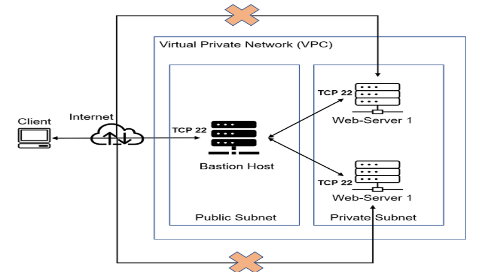
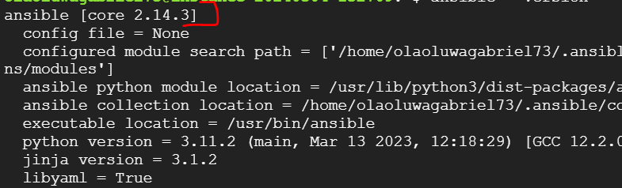
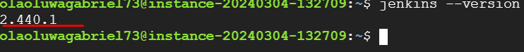
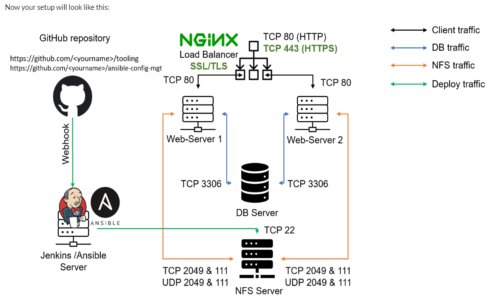

## ANSIBLE AUTOMATE PROJECT



On the diagram above, the virtual private Network (VPC) is divided into teo subnets - public subnet and private subnet. The private subnet is only reachabale by private IP addresses. The public subnet has public ip addresses.

A jump server in the above( Sometimes refered to as Bastion Host) is an intermediary server through which access to internal network can be provided. according to this diagram above, the web servers are inside a secure network which cannot be reached directly from the internet. That means, even DevOps engineers cannot ssh into the webservers directly and can only access it through a jump server- it provides better security and reduce attack surface.

In this project, I will developed `Ansible` scripts to simulate the use of a `jump box/Bastion host` to access Web servers.

## Install and configure Ansible Client to act as a Jump Server/Bastion Host
Step 1: 
1. I Installed and configured ansible on vm instance. I used Google cloud for this project.
2. Installed `Jenkins` on the same vm instance. Update the `name` of the tag on the vm instance to be `Jenkins-Ansible`
3. In the Github account, a new repository was created and named `ansible-config-mgt` 


Use the command below to intall ansible
```
sudo apt update

sudo apt install ansible
```

#### Check ansible version by running
`ansible --version`



#### check Jenkins version by running
`jenkins --version`





4. Configure Jenkis build job to archive your repository content every time you change it. 
- Create a new freestyle project `ansible` in jenkins and point it to the `ansible-config-mgt repository`
- Confiure a webhook in Github and set the webhook to trigger `ansible` builds
- Configure a Post-build job to save all (`**`) files.

5. Test the setup by making changes in README.md file in master branch and make sure that builds starts automaticaly and jenkins saves the files (build artifacts) in following folder.


`ls /var/lib/jenkins/jobs/ansible/builds/<build_number>/archive/`

<b>Note<b/> : Trigger Jenkins project execution only for main(or master) branch.





Step 2:
- Clone down ansible-config-mgt repo to Jenkins-Ansible instance.
In this project, i used VS code as my Integrated Development Environment(IDE)

use the command below to clone down the ansible-config-mgt repo.

`git clone <ansible-config-mgt repo link>`
