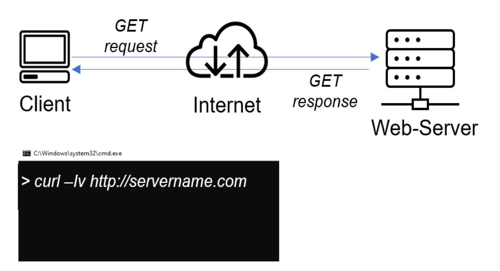

### Client  Server Architecture Using the MYSQL Database Management System (DBMS)

Client Server refer to an architecture in which two or more computers are connected together over the network to send and receive request between one another.

In their communication, each machine as its own role. The machine sending request is refered to as the 'client' and the machine responding(serving) to the request is called 'Server'. 

See the screenshot below:

In the diagram above, the machine that is trying to access a web site using the web browser or a curl command is referred to as the client. It sends an HTTP request to a web server (Nginx, Apache IIS etc)
over the internet.

The diagram below explains when Database is added.

In this case above, the web server fuctions as a client server, because it connects and read/writes to/from a database server, and the communication happens between them over a local network or the internet.
But it is common practice to place web server and DB server in the same local network.

### Kindly see Steps Implemention below:

Step 1: I created and configured two linux based virtual server (EC2 AWS Instances)

Server A name - `mysql server`

Server B name - `mysql client`

Step 2: On Server A (Mysql server), I installed MYSQL server software.

Step 3: On server B (Mysql client), I installed MYSQL Client software.

Note that by default, the two EC2 instances created , their Ips are in the same local network. and they can communicate.
 - I use the mysql server's local ip to connect from mysql client. 
 - Also Mysql server listens on tcp port 3306 by default.
 - I opened an inbound rule, with TCP port 3306 opened, and then allow only the local ip of the mysql client for proper security measure.  

Step 4: Then I configured the mysql server to be able to allow connection from remote host.

Open the configuration file by:

`sudo vi /etc/mysql/mysql.conf.d/mysqld.cnf` 

Then change bind-address from `127.0.0.1` to `0.0.0.0`

step 5: Then from mysql client linux server, connect to the mysql server database engine without using ssh, but by using mysql utilities to perform the action.

Step 6: To check if mysql server is successfully connected and I can perform SQL queries, use the command

`Show databases;`

The result below is seen.

