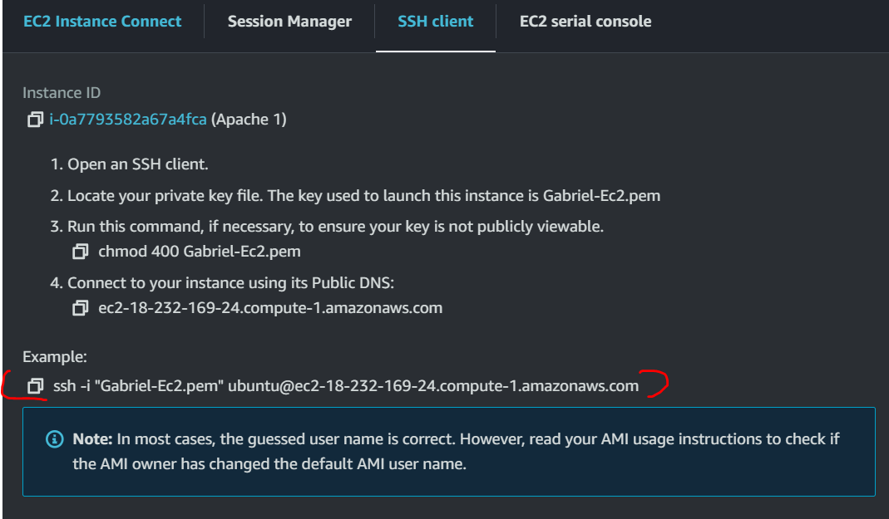

### IMPLEMENTING LOAD BALANCER WITH NGINX
Load balancing is a concept of distributing incoming network traffic and workloads across multiple servers, ensuring efficient utilization of resources and improving overall system performance, reliability, and availability.

Nginx is a versatile software, it can act like a webserver, reverse proxy and a load balancer etc. All that is needed is to configure it properly to serve the right use case.

###Setting up a Load balancer

Step 1: I will be provisioning two EC2 instances and running apache web server on them.


Then click on one each of  them to edit the inbound rule.


Step 2: I will be opening port 8000. The web server will running on port 8000, while the load balancer will be running on port 80.

see below the screenshot , i added another rule under the security group .

Click on the security group and then click on add  rule


Then the port 8000 is now added.


Note: The second server was configured same way with port 8000.


Step 3:  Installing Apache Webserver, after provisioning both servers and opening the necessary port 8000 to the webservers.

Firstly connected to the provisioned server as below through ssh:




Note: Do same for web server 2.

Then to install apache, using the command below:

* `sudo apt update`

* `sudo apt install apache2 -y`

You will get the output below after successful installation:


(Do same for web server 2)


* Then verfify if apache server is running/active using below command:

* `sudo systemctl status apache2`


Step 4: Configured Apache to serve a page showing its public ip address.
This is by configuring web server to serve content on port 8000 instead of its default port.

* Now below shows the command and path to get into the file:

* `sudo  vi /etc/apache2/ports.conf`

This will bring out the output below:


* Next i opened  the file /etc/apache2/sites-available/000-default.conf and changed the default port 80 to 8000

* `sudo vi /etc/apache2/sites-available/000-default.conf`


Then edited to 8000


* Then reload the apache server , so as change to take effect.

* `sudo systemctl restart apache2`


* Now creating new html file

* `sudo vi index.html`

and then the code below is pasted in the above index.html file.

```
        <!DOCTYPE html>
        <html>
        <head>
            <title>My EC2 Instance</title>
        </head>
        <body>
            <h1>Welcome to my EC2 instance</h1>
            <p>Public IP: 18.232.169.24</p>
        </body>
        </html>

```

* Then change file ownership of the index.html as seen below:

* `sudo chown www-data : www.data ./index.html`

* Now, to override the default index.html with the new html file, the command below was used:

* `sudo cp -f ./index.html /var/www/html/index.html`


* Then, restart the webserver with command below:

* `sudo systemctl restart apache2`


Then opened the browser and  pasted the IP, A page below shows configuration is fine.


Note that same configuration process follows on the second EC2 instance  that was spun.

### Step 5: Configure nginx as a load balancer.

Now spin another EC2 instance and and open port 80 to accept traffic from anywhere.


* follow  the previous step about on provisioning EC2

* Then update your server and install nginx.

* After installation, check the status.

* `sudo systemctl status nginx`


* Test if configuration is okay


 `sudo systemctl nginx -t`


 * Reload nginx for configuration to take effect

 `sudo system reload nginx`


 *Then copy the public IP of the nginx load balancer and open on the browser.
you see below screenshot.


Note:


