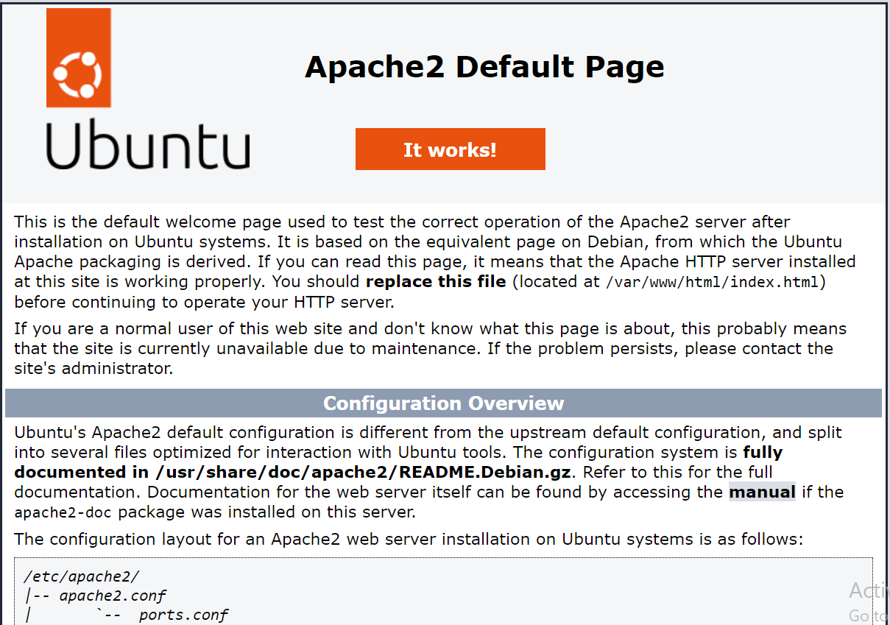

### AUTOMATING LOAD BALANCER CONFGIGURATION WITH SHELL SCRIPTING

Deployng and Configuring the  web server

In the previous project of implementation of load balancer, I deployed two backend servers manually through the terminal...I also deployed a load balancer that distribute traffic across these backend servers.

This was all done by typing somw commands on the terminal.

In this project, I will be automating the entire process by simply creating a shell script that when executed , it will automatically do what should have been done manually.

### Deploying and configuring the web server 

This is done using the scipt below:

```
#!/bin/bash

####################################################################################################################
##### This automates the installation and configuring of apache webserver to listen on port 8000
##### Usage: Call the script and pass in the Public_IP of your EC2 instance as the first argument as shown below:
######## ./install_configure_apache.sh 127.0.0.1
####################################################################################################################

set -x # debug mode
set -e # exit the script if there is an error
set -o pipefail # exit the script when there is a pipe failure

PUBLIC_IP=$1

[ -z "${PUBLIC_IP}" ] && echo "Please pass the public IP of your EC2 instance as an argument to the script" && exit 1

sudo apt update -y &&  sudo apt install apache2 -y

sudo systemctl status apache2

if [[ $? -eq 0 ]]; then
    sudo chmod 777 /etc/apache2/ports.conf
    echo "Listen 8000" >> /etc/apache2/ports.conf
    sudo chmod 777 -R /etc/apache2/

    sudo sed -i 's/<VirtualHost \*:80>/<VirtualHost *:8000>/' /etc/apache2/sites-available/000-default.conf

fi
sudo chmod 777 -R /var/www/
echo "<!DOCTYPE html>
        <html>
        <head>
            <title>My EC2 Instance</title>
        </head>
        <body>
            <h1>Welcome to my EC2 instance</h1>
            <p>Public IP: "${PUBLIC_IP}"</p>
        </body>
        </html>" > /var/www/html/index.html

sudo systemctl restart apache2

```


So, to run the script, I used the steps below:

1) I Provisioned an EC2 instance running ubuntu 20.4. You can refer to my previous project on how to provision a server on AWS.


2) I Opened port 8000, under the security group to allow traffic from anywhere


3) I Connected to the web server via ssh on any desired terminal(Git bash, Termius, VSCODE etc). Here i used Termius.


4) Then I executed  the script above. By opeining a file, pasting the script. 

See below command for step 4

`sudo vi install.sh`

paste the script above in this opened file, then save and close the file with the command after using `esc`.
You save and close with `shift + :wqa!`


5) Change the  permission of the file to make it executable.

`sudo chmod +x install.sh`


6) The Run the shell script using the command below for both servers:

`./install.sh 54.89.104.163`

`./install.sh 35.153.132.173` 


### CONFIGURING AND INSTALLING THE NGINX LOAD BALANCER

The script below is written to configure the Nginx Load balancer.

```
#!/bin/bash

######################################################################################################################
##### This automates the configuration of Nginx to act as a load balancer
##### Usage: The script is called with 3 command line arguments. The public IP of the EC2 instance where Nginx is installed
##### the webserver urls for which the load balancer distributes traffic. An example of how to call the script is shown below:
##### ./configure_nginx_loadbalancer.sh PUBLIC_IP Webserver-1 Webserver-2
#####  ./configure_nginx_loadbalancer.sh 127.0.0.1 192.2.4.6:8000  192.32.5.8:8000
############################################################################################################# 

PUBLIC_IP=$1
firstWebserver=$2
secondWebserver=$3

[ -z "${PUBLIC_IP}" ] && echo "Please pass the Public IP of your EC2 instance as the argument to the script" && exit 1

[ -z "${firstWebserver}" ] && echo "Please pass the Public IP together with its port number in this format: 127.0.0.1:8000 as the second argument to the script" && exit 1

[ -z "${secondWebserver}" ] && echo "Please pass the Public IP together with its port number in this format: 127.0.0.1:8000 as the third argument to the script" && exit 1

set -x # debug mode
set -e # exit the script if there is an error
set -o pipefail # exit the script when there is a pipe failure


sudo apt update -y && sudo apt install nginx -y
sudo systemctl status nginx

if [[ $? -eq 0 ]]; then
    sudo touch /etc/nginx/conf.d/loadbalancer.conf

    sudo chmod 777 /etc/nginx/conf.d/loadbalancer.conf
    sudo chmod 777 -R /etc/nginx/

    
    echo " upstream backend_servers {

            # your are to replace the public IP and Port to that of your webservers
            server  "${firstWebserver}"; # public IP and port for webserser 1
            server "${secondWebserver}"; # public IP and port for webserver 2

            }

           server {
            listen 80;
            server_name "${PUBLIC_IP}";

            location / {
                proxy_pass http://backend_servers;   
            }
    } " > /etc/nginx/conf.d/loadbalancer.conf
fi

sudo nginx -t

sudo systemctl restart nginx

```


Steps to run the shell script 

Step 1: Open a file named nginx.sh

`sudo vi nginx.sh`

Step 2: Copy and paste the script inside of the file

Step 3: Save and close the file

`shift + :wqa!`

Step 4: Change the permission for the file to be executed

`sudo chmod +x nginx.sh`

Step 5: Then run the file as below:

`./nginx.sh PUBLIC_IP webserver-1 webserver-2`

This will be exactly like this below:


`./nginx.sh 54.159.109.168 54.89.104.163:8000 35.153.132.173:8000`


### VERIFYING THE SET UP





