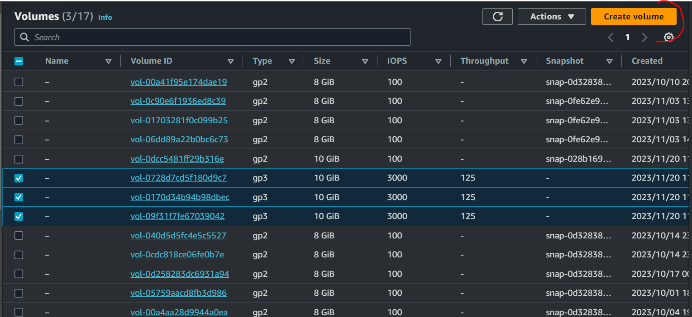
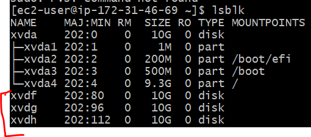
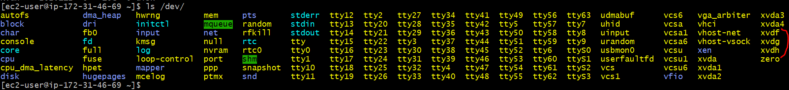
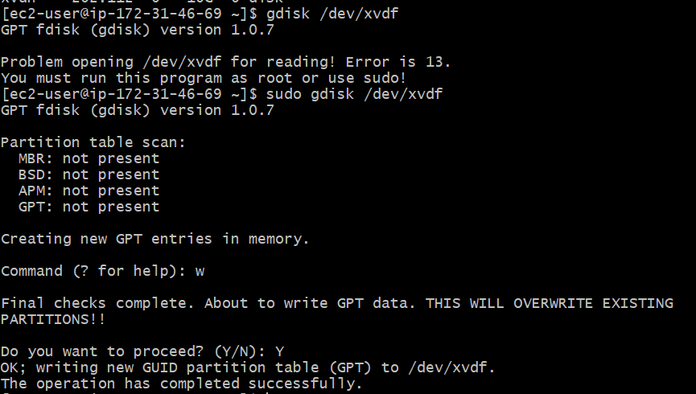

### IMPLEMENTING WORD PRESS WEBSITE WITH LVM STORAGE MANAGEMENT

In this project I prepared a storage infrastructure on two Linux servers and implemented a basic web solution using WordPress. 

Wordpress is an open-source content management system written in PHP nad paired with MySQL or MariaDB as its backend Relational Database Management System (RDBMS).

This project consists of two parts:

1) Configuring storage subsystem for web and Database servers based on Linux OS. 
2) Installing WordPress and connect it to a remote MySQL database server.


### Three-Tier Architecture

Generally, web or , mobile solutions are implemented based on Three-tire Architecture.

Three-tire Architecture is a client-server software architecture pattern that comprise of 3 separate layers.

1) Presentation Layer : This is the user interface such as the client server or browser on your laptop
2) Business Layer : This is the backend program that implements business logic. Application or Webserver
3) Data Access or Management Layer (DAL): This is the layer for computer data storage and data access. Database Server or File system server such as FTP server, or NFS Server.


### 3-Tier Setup

1) Alaptop or PC to serve as a client
2) An EC2 Linux Server as web server (This is where you will install WordPress)
3) An EC2 Linux server as database (DB) server.

In this project, I used a Redhat Linux distribution.


Step 1 : Prepare a webserver

I launch an EC2 instance that will server as Web Server. Created 3 volumes in the same AZ as Webserver EC2, each of 10GiB.

Below is the volume created using the create volume button.





The volumes are attached to the EC2 Instance provisioned.

Step 2: To begin configuration, firstly checked the volumes that have been created and attached to EC2 instance using the command on:
* `lsblk`              




*  and     `ls /dev/`





step 3: To see all mount and free space on the server, use 

* `df -h`

Step 4: To create a single partition on each of the 3disks

* `gdisk`

like;

* `sudo gdisk /dev/xvdf`

* `sudo gdisk /dev/xvdg`

* `sudo gdisk /dev/xvdh`


Once you used the command above, then you follow the promptings as seen below:





Step 5: Then Install lvm2 with the command 

* `sudo yum install lvm`

Then;

check the available partitions

* `sudo lvmdiskscan`


Step 6: Then we have to mark these three disks as physical volume, for them to be recognised and used as LVM.

Use the `pvcreate` utility


```
sudo pvcreate /dev/xvdf1
sudo pvcreate /dev/xvdg1
sudo pvcreate /dev/xvdh1

```

