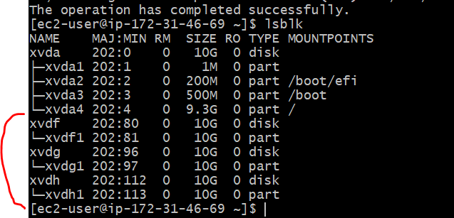
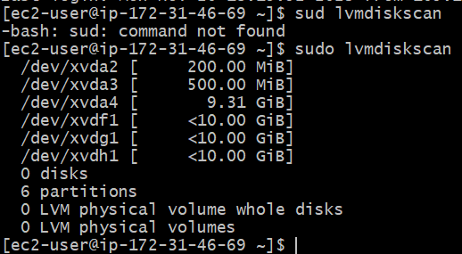
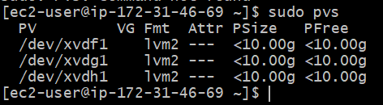
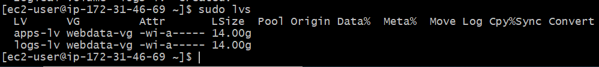
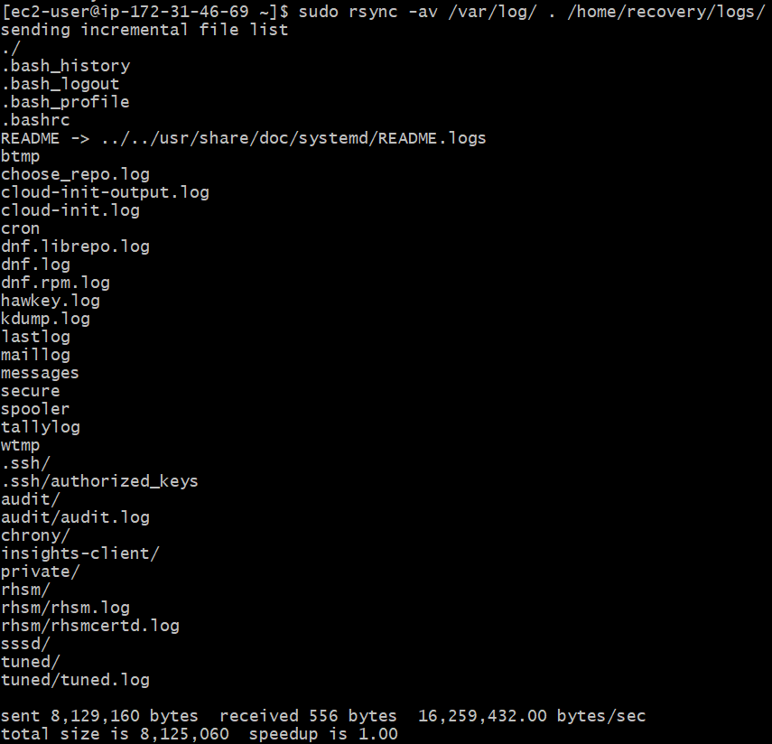

### IMPLEMENTING WORD PRESS WEBSITE WITH LVM STORAGE MANAGEMENT

In this project I prepared a storage infrastructure on two Linux servers and implemented a basic web solution using WordPress. 

Wordpress is an open-source content management system written in PHP nad paired with MySQL or MariaDB as its backend Relational Database Management System (RDBMS).

This project consists of two parts:

1) Configuring storage subsystem for web and Database servers based on Linux OS. 
2) Installing WordPress and connect it to a remote MySQL database server.


### Three-Tier Architecture

Generally, web or , mobile solutions are implemented based on Three-tire Architecture.

Three-tire Architecture is a client-server software architecture pattern that comprise of 3 separate layers.

1) Presentation Layer : This is the user interface such as the client server or browser on your laptop
2) Business Layer : This is the backend program that implements business logic. Application or Webserver
3) Data Access or Management Layer (DAL): This is the layer for computer data storage and data access. Database Server or File system server such as FTP server, or NFS Server.


### 3-Tier Setup

1) Alaptop or PC to serve as a client
2) An EC2 Linux Server as web server (This is where you will install WordPress)
3) An EC2 Linux server as database (DB) server.

In this project, I used a Redhat Linux distribution.


Step 1 : Prepare a webserver

I launch an EC2 instance that will server as Web Server. Created 3 volumes in the same AZ as Webserver EC2, each of 10GiB.

Below is the volume created using the create volume button.


The volumes are attached to the EC2 Instance provisioned.

Step 2: To begin configuration, firstly checked the volumes that have been created and attached to EC2 instance using the command on:
* `lsblk`              


*  and     `ls /dev/`


step 3: To see all mount and free space on the server, use 

* `df -h`

Step 4: To create a single partition on each of the 3disks

* `gdisk`

like;

* `sudo gdisk /dev/xvdf`

* `sudo gdisk /dev/xvdg`

* `sudo gdisk /dev/xvdh`


Once you used the command above, then you follow the promptings as seen below:


Step 5: Then Install lvm2 with the command 

* `sudo yum install lvm`

Then;

check the available partitions


* `sudo lsblk`





* `sudo lvmdiskscan`





Step 6: Then we have to mark these three disks as physical volume, for them to be recognised and used as LVM.

Use the `pvcreate` utility


```
sudo pvcreate /dev/xvdf1
sudo pvcreate /dev/xvdg1
sudo pvcreate /dev/xvdh1

```

use `sudo pvs` to check the physical volumes created.





step 7: We create a volume group and then add all the physical volumes created to the VG. 

The VG is named **webdata-vg**

* `sudo vgcreate webdata-vg /dev/xvdf1 /dev/xvdg1 /dev/xvdh1`


To check the volume group created us the command below

* `sudo vgs`


step 8: Then we create 2 logical volumes of 14G each from the Volume group. apps-lv takes half of the size of the PV, logs-lv use the remaining space of the PV size.

Note: apps-lv will be used to store data for the website, while logs-lv is used to store data or logs.


create the lv with the command below:


* `sudo lvcreate -n apps-lv -L 14G webdata-vg`
* `sudo lvcreate -n log-lv -L 14G webdata-vg`


to verify, do `sudo lvs`





step 9: Then I make filesystem, this to to make the files to be compactiple with the normal files on the server.
we use the command `mkfs.ext4` to format the logical volume with ext4 filesystem.

* `sudo mkfs -t ext4 /dev/webdata-vg/apps-lv`

* `sudo mkfs -t ext4 /dev/webdata-vg/logs-lv`

step 10: Then create a /var/www/html file to store website files.

* `sudo mkdir -p /var/www/html`


step 10: Then create a /home/recovery/log file to backup log data.

* `sudo mkdir -p /home/recovery/logs`

step 11: Then we mount /var/www/html on the apps.lv logical volume

* `sudo mount /dev/webdata-vg/apps-lv /var/www/html`

step 12: Then we have to also mount /var/log on the logs-lv logical volume.

But, to do this, you'll need to backup the logs in the /var/log file, because all logs on /var/log will be wiped out after mounting. Therefore to prevent this , we will backup the logs in the /home/recovery/logs file. Then take the logs back after mounting is completely done.


Use the command below to backup the logs in /home/recovery/log

* `sudo rsync -av /var/log/ . /home/recovery/logs`





step 13: Then you can now mount the /var/log on the logs-lv

* `sudo mount /dev/webdata-vg/logs-lv /var/log`


step 14: At this point, we can now transfer back the logs earlier moved to `/home/recovery/log` back to /`var/log`


* `sudo rsync -av /home/recovery/logs /var/log`


